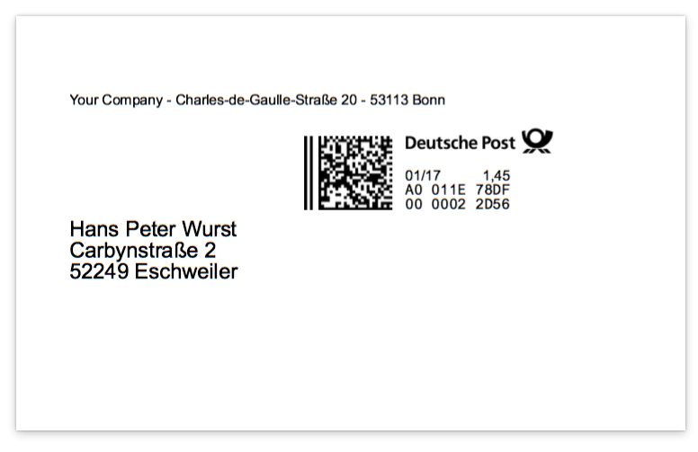

# Posthorn

Easy access to Deutsche Post 1C4A webservice

With this Gem it is possible to order pre-paid shipping stickers from the Deutsche Post. Payment is done through the so called "Portokasse", a prepaid wallet service. To use this Gem a registration for the "Portokasse" and the 1C4A webservice is necessary. For more detailed information see (Sorry, only in German language...)

https://portokasse.deutschepost.de/portokasse/#/

https://www.deutschepost.de/de/i/internetmarke-porto-drucken/partner-werden.html


## Installation

Add this line to your application's Gemfile:

```ruby
gem 'posthorn'
```

And then execute:

    $ bundle

In case this Gem is used within a Rails application add a new initializer and add the following content

```ruby
Posthorn.configure do |c|
  c.dpwn_key = Rails.application.secrets[:posthorn_dpwn_key]
  c.partner_id = Rails.application.secrets[:posthorn_partner_id]
  c.key_phase = 1
  c.username = Rails.application.secrets[:posthorn_username]
  c.password = Rails.application.secrets[:posthorn_password]
end
```

Use the secrets.yml file to securely store all necessary keys and passwords.


## Usage

This example will order a single domestic shipping label. The sandbox credentials can be used to run the example without burning real cash. To execute it, Posthorn should be already configured as shown above.

```ruby
# Open a new (post-)office
office = Office.new

# Create a new recveiver and sender address, country codes can be ISO3166 Alpha2 codes or Countries Gem instances
# see https://github.com/hexorx/countries for details
receiver = Address.new(
  firstname: 'Hans Peter',
  lastname: 'Wurst',
  street: 'Carbynstraße',
  no: '2',
  city: 'Eschweiler',
  zip: '52249',
  country: 'de')

sender = Address.new(
  company: 'Your Company',
  street: 'Charles-de-Gaulle-Straße',
  no: '20',
  city: 'Bonn',
  zip: '53113',
  country: 'de')

# Add a new label to the shopping cart
# for product_id and price, please referee to Deutsche Post ProdWS database
# in this example ID 21 is used which is a large size letter, price is Euro 1.45
office.cart << Label.new(sender, receiver, product_id: 21, price: 145)

# all available page formats can be received with
# puts office.page_formats
labels = office.checkout!(page_format: 25)
IO.write('labels_as_pdf_file.pdf', labels)
```

The output will be a ready to use shipping label as shown below.




## License

Posthorn is Copyright © 2018 by AISLER B.V. It is free software, and may be
redistributed under the terms specified in the license file.

## About AISLER


Posthorn is developed and funded by AISLER B.V.

Want to build powerful electronic prototypes? Visit us at [AISLER](https://aisler.net)
